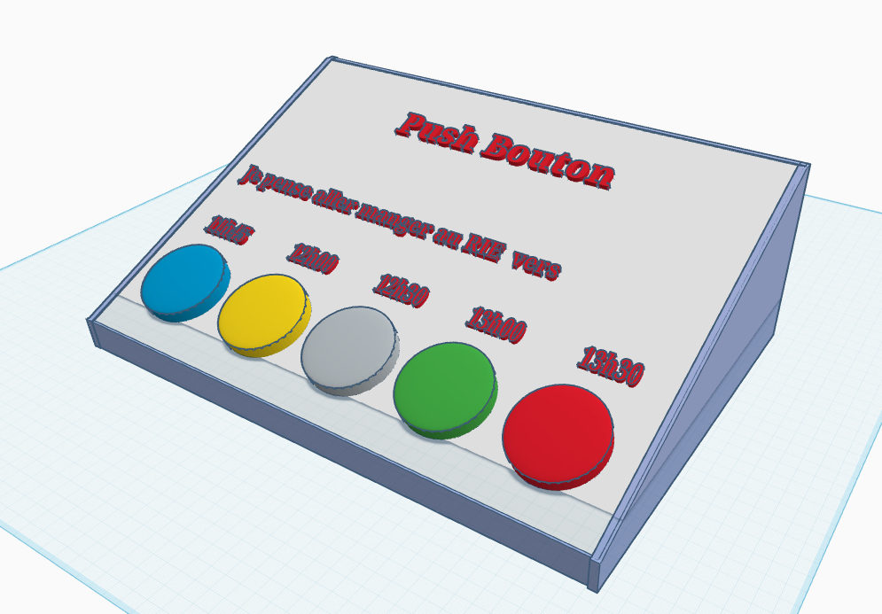
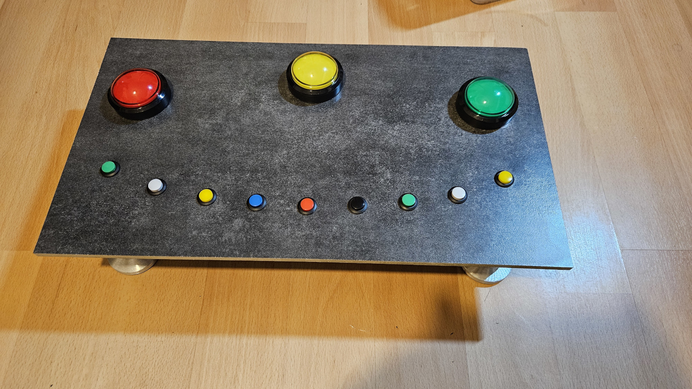
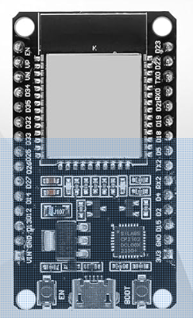
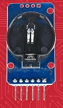
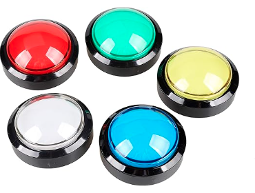

# Push Bouton - Système de Vote pour Estimation du Nombre de Convives au restaurant d'entreprise

## Problématique

Le **RIE (Restaurant d'entreprise)** nécessite une estimation du nombre de convives pour optimiser la préparation des repas et l'organisation logistique. 

## But du Projet

Développer une **platine de vote électronique** permettant de comptabiliser automatiquement le nombre de convives souhaitant déjeuner au RIE, offrant ainsi une solution moderne et efficace pour l'estimation des participants.

## Vue d'ensemble de la Platine

### Caractéristiques Principales
- Système de vote intuitif et accessible
- Consultation des statistique via interface web
- La borne met à disposition son propre point d'accès wifi sécurisé
- Alimentation par USB pour une utilisation flexible
- Boîtier compact et portable

## Photos du Système

- Vue d'ensemble de la platine

- Vue de la platine adapté sur un autre usage

- Interface utilisateur

- Composants internes

[l'ESP 32](https://www.amazon.fr/dp/B0D86JL12Q) 
 

[Une Horloge RTC](https://www.amazon.fr/dp/B077XN4LL4) 
 

Les boutons : [Gros boutons lumineux de 60mm de diamètre](https://www.amazon.fr/dp/B01MSNXLN0) 
 
 

## Shema Electrique : 

## Dimensions et Poids

- **Dimensions** : 406 mm x 276 mm x 133 mm
- **Poids** : < 2000 grammes
- **Format** : Portable et facilement transportable

## Liste des Composants

### Composants Principaux
- **Microcontrôleur** : ESP32 (WiFi + Bluetooth intégré)
- **Alimentation** : Chargeur téléphone USB ou prise avec port USB aux normes NF / CE
- **Boîtier** : Bois/Plexi/Impression 3D, à définir en fonction des contraintes

### Composants Additionnels
- LED d'indication de statut
- Boutons de selection

## Alimentation

### Caractéristiques Électriques
- **Tension d'entrée** : 5V DC via USB
- **Tension de fonctionnement** : 3.3V (régulée en interne)
- **Puissance consommée** : 
  - Mode actif WiFi : ~240 mA
  - Mode veille : ~10 µA
  - Puissance totale : ~1.2W en fonctionnement normal

### Sources d'Alimentation
- Chargeur de téléphone standard (5V/1A minimum)
- Port USB d'ordinateur
- Batterie externe USB (power bank)
- Adaptateur secteur USB

## Spécifications WiFi

### ESP32 - Caractéristiques Radio
- **Standard** : IEEE 802.11 b/g/n (WiFi 4)
- **Fréquence** : 2.4 GHz
- **Puissance d'émission** : 
  - Maximum : +20 dBm
  - Typique : +18 dBm
- **Portée** : Jusqu'à 150m en champ libre
- **Modes supportés** : 
  - Station (STA)
  - Point d'accès (AP)
  - Station + Point d'accès simultané

## Interface Homme-Machine (IHM)

### Accès au Système
- **Mode de connexion** : Hotspot WiFi intégré
- **SSID** : "MoodDetector-Vote"
- **URL d'accès** : `http://192.168.4.1` ou `http://mood-detector.local`
- **Interface** : Page web compatible mobile/desktop

### Fonctionnalités de l'Interface
- Comptage simple, possibilité d'évoluer et de comptabiliser par créneau horaire
- Consultation des résultats en temps réel sur l'interface web
- Export des données au format csv

## Code Source

Le code source complet du projet est disponible sur GitHub :

**🔗 [https://github.com/y0gi44/mood-detector](https://github.com/y0gi44/mood-detector)**

### Structure du Repository
- `/Hardware` : Schémas électroniques et fichiers de conception
- `/Software` : Code ESP32 (Arduino IDE/PlatformIO)
- `/Web` : Interface utilisateur (HTML/CSS/JavaScript)
- `/Documentation` : Guides d'utilisation et documentation technique

---

## Installation et Utilisation

### Mise en Route
1. Connecter l'alimentation USB
2. Attendre l'initialisation (LED de statut)
3. Se connecter au réseau WiFi "MoodDetector-Vote"
4. Accéder à l'interface via navigateur web
5. Commencer le vote

### Support Technique
Pour toute question ou problème, consulter la documentation sur GitHub ou créer une issue sur le repository du projet.

---

*Projet développé pour estimer le nombre de convives au Restaurant d'entreprise - RIE 2025*
