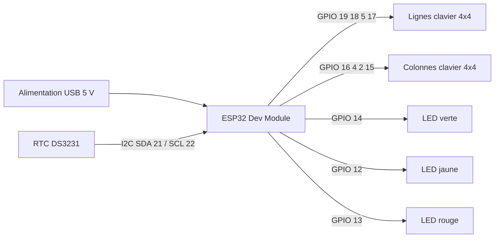

# Schema de cablage

Ce document decrit le cablage correspondant au firmware `Mood` actif.

## Vue fonctionnelle



## Alimentation et masse

| Element | VCC | GND | Remarque |
|---|---:|---:|---|
| ESP32 | USB 5 V | GND | Utiliser une alimentation stable de 5 V / 1 A minimum |
| RTC DS3231 | 3.3 V | GND | Ne pas appliquer 5 V sur une entree GPIO |
| Clavier 4x4 | 3.3 V si necessaire | GND commun | Les 8 lignes sont lues par la bibliotheque Keypad |
| LEDs | GPIO via resistance | GND commun | Prevoir une resistance serie par LED |

## RTC DS3231

| DS3231 | ESP32 |
|---|---:|
| SDA | GPIO 21 |
| SCL | GPIO 22 |
| VCC | 3V3 |
| GND | GND |

Le firmware utilise `RTC_DS3231` et initialise l'heure avec la date de compilation si le module signale une perte d'alimentation.

## LEDs de retour utilisateur

| Fonction | Couleur | GPIO firmware |
|---|---|---:|
| Mood 1 | Vert | 14 |
| Mood 2 | Jaune | 12 |
| Mood 3 | Rouge | 13 |

Le GPIO ne doit pas alimenter directement une charge importante. Pour un gros bouton lumineux ou une lampe, utiliser un transistor ou un module de commande adapte.

## Clavier matriciel 4x4

Le tableau de touches defini dans `lib/Keyboard/Keyboard.cpp` est :

```text
Ligne 0 : 6  5  D  A
Ligne 1 : 7  4  ;  B
Ligne 2 : 8  3  2  C
Ligne 3 : 9  1  #  *
```

### Broches

| Groupe | GPIO |
|---|---|
| Lignes | 19, 18, 5, 17 |
| Colonnes | 16, 4, 2, 15 |

Les boutons de vote utilisent `A`, `B` et `C`. Les touches numeriques selectionnent les equipes dans la logique `Mood`.

## Regles de cablage

- relier toutes les masses ensemble ;
- garder les fils I2C courts autant que possible ;
- ne pas utiliser un GPIO deja affecte a une autre fonction ;
- verifier le brochage reel de la carte ESP32 30 broches avant soudure ;
- tester chaque GPIO avec une mesure de continuite avant la mise sous tension.

## Verification avant mise sous tension

1. Verifier l'absence de court-circuit entre 3V3 et GND.
2. Verifier le sens SDA/SCL.
3. Verifier les resistances serie des LEDs.
4. Verifier que les boutons ne renvoient pas 5 V vers l'ESP32.
5. Alimenter d'abord par USB avec les LEDs de puissance debranchees si le montage est nouveau.
